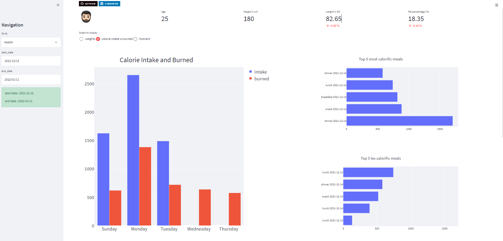
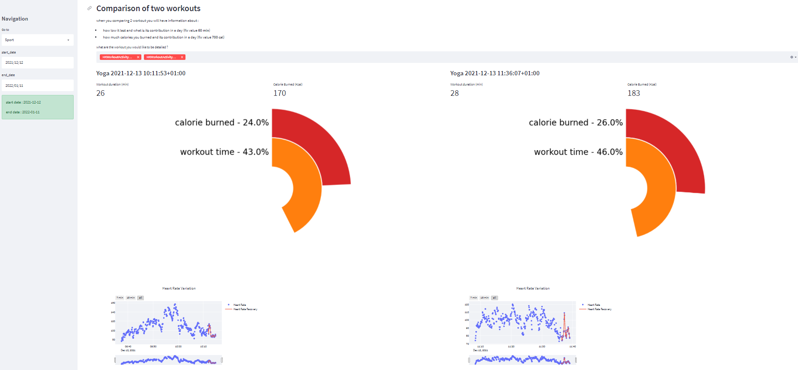

# streamlit_health_app
creating dashbaord usig different health data source (apple health data, myfitnesspal app...)

This is a 2 pages dashboard that shows : 
- general information about you weight and food consumption 
- general information about you activity. 

It has been done using apple health data where different data are centralised (apple watch, connected balance...)
and myfitnesspal app where you can record all your meals. 

The data from apple healt data is an xml file that can be downloaded using your iPhone. 
For my fitnesspal I used the API (give credit/source) to gather all information needed. 

All the cleaning, preprocessing, analysing have been done using python. 
And the Dashboard was created by using Streamlit. 

!! images need to be reaplce by a short video !!

